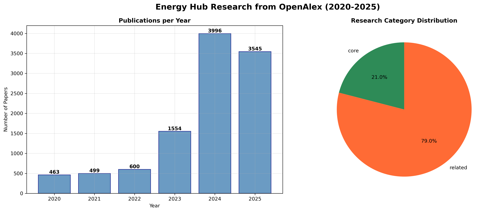
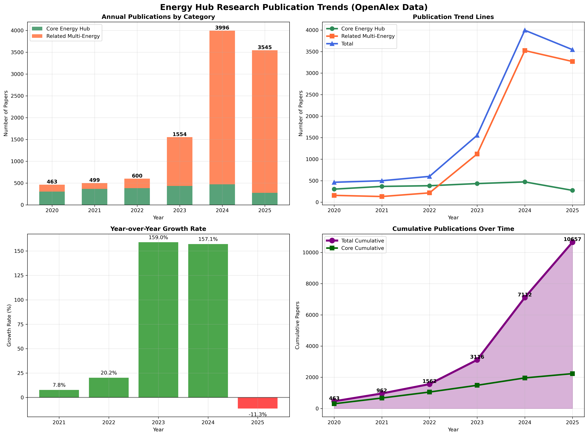

# 📊 OpenAlex Energy Hub Research Collector

**One script. Clean data. Clear charts.** This repository collects and analyzes **Energy Hub** research from the OpenAlex database, exports tidy CSVs, and renders publication-trend visuals—so you can stop copy‑pasting from search portals and start doing actual research.

> Data source: [OpenAlex](https://openalex.org/) (thanks, OurResearch ❤️)

---

## ✨ Features

- **Targeted search** for *Energy Hub* and related multi‑energy system terms
- **Title + abstract strategies** to balance precision and recall
- **Deduplication** via OpenAlex IDs and normalized titles
- **Clean exports** to CSV for downstream analysis
- **Visualizations** for yearly counts, category split, trends, growth, and cumulative totals
- **Ready-to-cite summary report** (plain‑text) for papers and mini‑reviews

---

## 🧱 Project Structure

```
openalex-energyhub-analysis/
├─ openalex_final.py
├─ README.md
└─ (generated after a run)
   ├─ openalex_energy_hub_papers.csv
   ├─ energy_hub_annual_summary.csv
   ├─ energy_hub_core_papers_by_year.csv
   ├─ energy_hub_core_plus_related_papers_by_year.csv
   ├─ energy_hub_paper_counts_by_year.csv
   ├─ openalex_energy_hub_analysis.png
   └─ energy_hub_publication_trends.png
```

---

## 🛠️ Installation

```bash
# 1) Clone
git clone https://github.com/YOUR_USERNAME/openalex-energyhub-analysis.git
cd openalex-energyhub-analysis

# 2) (Optional) Create a virtual environment
python -m venv .venv && source .venv/bin/activate  # Windows: .venv\Scripts\activate

# 3) Install dependencies
pip install -r requirements.txt
# or
pip install requests pandas matplotlib
```

> **Python 3.9+** recommended.

---

## ▶️ Usage

Run the script and pick a mode:
```bash
python openalex_final.py
```

You’ll see a prompt:
```
Choose analysis option:
1. Complete analysis (recommended) - All CSV files + charts
2. Research summary report - Formatted for academic use
3. Basic collection - Simple CSV + chart
4. Quick test - Test functionality
```

- **Option 1**: end‑to‑end pipeline → charts + CSVs + stats
- **Option 2**: quick paper‑friendly summary text file
- **Option 3**: fast CSV + single chart
- **Option 4**: verify connectivity/queries only

**Email hint:** OpenAlex loves a `mailto=`. The script prompts for your email (used in the query). Add a real one to be a good API citizen.

---

## ⚙️ Configuration

Edit search terms inside `OpenAlexEnergyHubCollector.__init__`:

```python
self.search_terms = {
  'core': ['energy hub', 'energy hubs', 'energy hub optimization', 'energy hub modeling'],
  'related': ['multi-energy system', 'integrated energy system', 'multi-carrier energy',
              'energy system integration', 'multi-energy hub', 'energy nexus']
}
```

Default time window is **2020–2025** for final inclusion; adjust in `search_works()` and `search_by_abstract()` if needed.

---

## 📦 Outputs

After a successful run you’ll get:

- **CSV datasets**
  - `openalex_energy_hub_papers.csv` – full cleaned set
  - `energy_hub_annual_summary.csv` – per‑year counts, OA share, citations, averages
  - `energy_hub_core_papers_by_year.csv` – detailed core‑topic papers
  - `energy_hub_core_plus_related_papers_by_year.csv` – combined core+related
  - `energy_hub_paper_counts_by_year.csv` – compact counts matrix

- **Charts**
  - `openalex_energy_hub_analysis.png` – year counts + category pie
  - `energy_hub_publication_trends.png` – stacked bars, trend lines, YoY growth, cumulative totals

- **Report**
  - `energy_hub_research_summary_report.txt` – formatted summary for academic use

---

## 🖼️ Preview (once you’ve run it)

> These image names are produced by the script; they’ll render in your repo once generated.





---

## 🧪 Example Console Output

> Replace this with your **actual run output** to keep the README honest.  
> (The script prints a comprehensive summary; copy it here.)

```
📊 OPENALEX COLLECTION SUMMARY:
----------------------------------------
By Category:
  core           : 35 papers
  related        : 42 papers

By Year:
  2020: 12 papers
  2021: 18 papers
  2022: 20 papers
  2023: 15 papers
  2024: 10 papers

Citation Statistics:
  Average citations: 8.4
  Max citations: 45
  Papers with >10 citations: 21
```

---

## 🧭 Tips & Gotchas

- **Rate limits / 429s:** The code sleeps between pages. If you hit limits, increase delays.
- **Missing abstracts:** OpenAlex stores an inverted abstract index. The CSV includes a small reconstructed sample; for full text, fetch the OA PDF when available.
- **Per‑page cap:** OpenAlex supports `per-page=200`. The script paginates up to a safety limit.
- **Filtering years:** Even if you query a broader range, final inclusion is gated to **2020–2025**.

---

## 🧩 Extending

- Add more synonyms/terms (esp. non‑English) to improve recall.
- Enrich the CSV with author affiliations, countries, or OA URLs.
- Swap `sort` strategies (`cited_by_count:desc` vs `publication_date:desc`) for different views.
- Pipe the CSVs into your favorite notebook for topic modeling or network graphs.

---

## 🙏 Acknowledgments

- **OpenAlex** — open bibliographic data for the win.
- **OurResearch** — for maintaining an incredible public good.

---

## 📜 License

Add your preferred license (MIT/Apache‑2.0 are great defaults).

---

## 📣 Citation

If you use the exported data in a paper:
```
Priem, J., Piwowar, H., & Orr, R. (2022). OpenAlex: A fully-open index of scholarly works, authors, venues, institutions, and concepts. ArXiv. https://arxiv.org/abs/2205.01833
```
